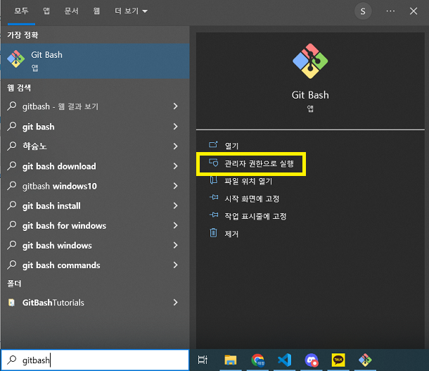
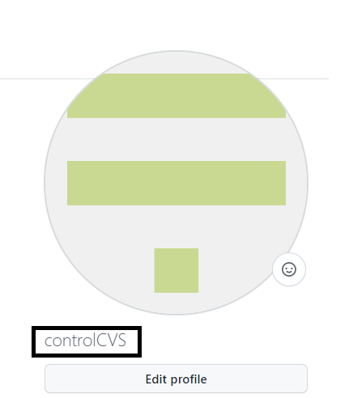
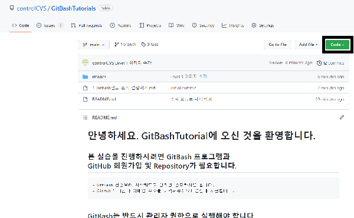
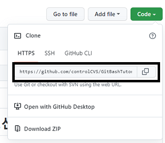
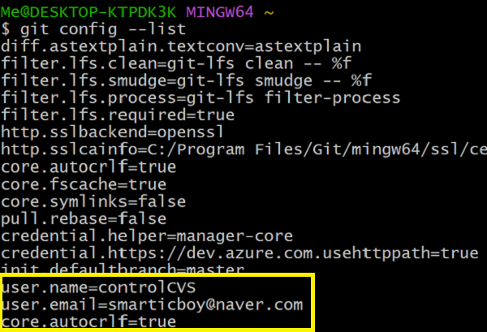

# Level 1. 'GitBash' 초기설정 하기.

## 'GitBash'를 관리자 권한으로 열어봅시다.

- windows 기준 `시작` -> `gitbash`검색 -> `관리자 권한으로 실행` 클릭 

## 'GitBash'는 'Linux' 기반의 프로그램입니다.

- 기존 윈도우에서 사용하는 명령어들은 사용이 불가능합니다.
- `Ctrl + C`, `Ctrl + V` 같은 좋은 단축키도 불가능합니다!
- 단축키는 다음에 자세히 다루고 일단은 설정을 해봅시다!

## 초기 설정

- 초기설정을 따라서 해봅시다.
- 'GitHub' 에서 본인 닉네임과 가입한 이메일을 가져옵니다.   프로파일 부근에서 그림에 표시된 것이 닉네임 입니다.
- GitHub에 Repository를 한개 만들고 주소를 가져옵니다.  `Code` 버튼을 클릭하면
- 짠 하고 주소가 나옵니다. 복사해주세요.  'HTTPS'로 복사합니다.
- 'GItBash'로 돌아와서 다음 명령어를 입력합시다. ""도 포함해서 입력해주세요.
- `git config --global user.name "본인 닉네임"` 을 입력하고 엔터를 눌러주세요.
- `git config --global user.email "본인 이메일"` 을 입력하고 엔터를 눌러주세요.
- `git config --global core.autocrlf true` 를 입력하고 엔터를 눌러주세요. 이 코드는 OS환경에 따른 엔터키 차이를 자동으로 해결해주는 설정입니다.

## 설정 확인 방법

- 설정을 했다면 설정이 잘 되었는지 확인할 차례입니다.
- 'GitBash' 에서 `git config --list` 를 입력 후 엔터를 눌러봅시다.
- 쭉 나온 코드들에서 아래 3줄을 확인해 봅시다.   닉네임, 이메일 autoclrf=true를 확인하여 입력한것과 동일하면 성공입니다. 

# 설정 종료, Level Up!

- 'GItBash'설정이 끝났다면 다음으로 넘어갑시다!
