# Level 2. GitBash명령어들

## GitBash의 명령어들을 배워봅시다.

- 그 전에 C드라이브 > Users(혹은 '사용자') > 계정(PC)명 폴더 아래 'git'이라는 폴더를 생성합니다.

## 'GitBash'를 관리자 권한으로 열어봅시다.

- windows 기준 `시작` -> `gitbash`검색 -> `관리자 권한으로 실행` 클릭 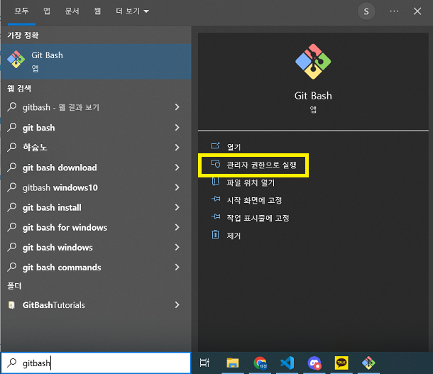

## 명령어들을 입력해 봅시다.

- `pwd`를 입력하고 엔터를 누릅니다. `pwd`는 현재 작업중인 폴더를 보여줍니다. 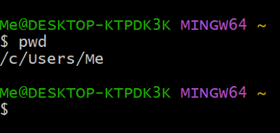

- `ls`를 입력하고 엔터를 누릅니다. `ls`는 현재 작업폴더 아래에 어떤 파일 및 폴더가 있는지 출력합니다. 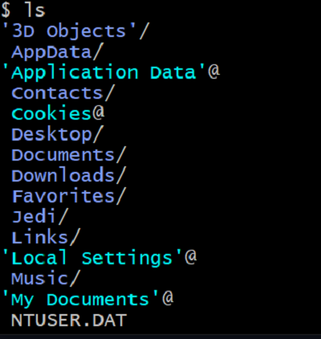

- `ls -a`로 '-a'옵션을 주면 숨겨진 파일(폴더)을 '.파일(폴더)명'으로 나타납니다. 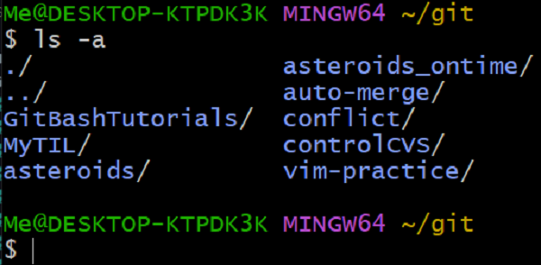

- `cd 폴더명`을 입력하면 '폴더명'으로 이동합니다. 인접 폴더로 이동하므로 2단계 위(아래)에 있는 폴더로 이동은 불가능합니다.
   위에서 만든 'git'폴더로 이동해 봅시다.
  

 코드 확인하기 

  
`cd git` 입력 후 엔터를 누릅니다. 입력창 위에 '~/git'이 보이면 성공!

  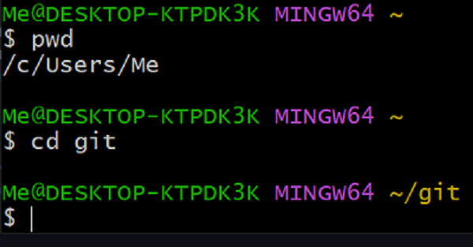

  
 

  <!-- details에 이미지를 넣고 싶다면, 이미지 코드 위 아래에 공백 필요-->

- `history`를 입력하고 엔터를 누릅니다. 기존의 입력한 코드들을 출력해줍니다. 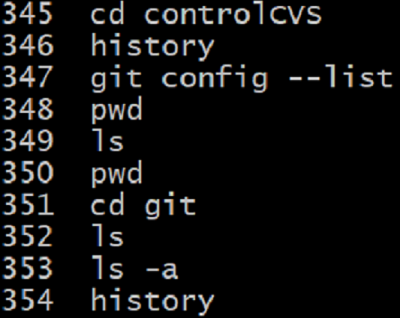

- `history`안에 있는 코드를 불러와 봅시다. `!123`를 입력하면 123에 해당하는 코드를 불러와 실행합니다.
   가장 최근에 입력했던 `ls`코드를 불러와 봅시다.
  

 코드 확인하기 

  
`!352` 입력 후 엔터를 누릅니다. 개인마다 번호가 다릅니다.

  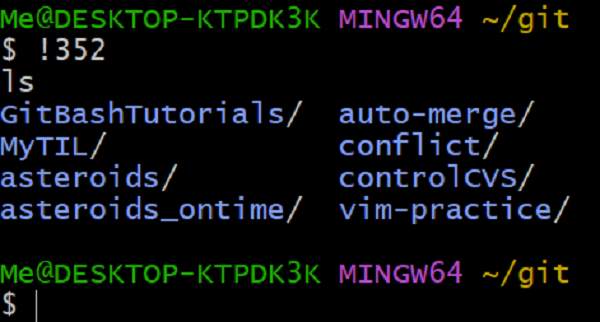

  
 

- `mkdir 폴더명`으로 '폴더명'에 해당하는 하위 폴더를 생성합니다.(mkdir = make direction의 약자)
   'git'아래에 'practice'폴더를 만들어 봅시다. 그리고 그 폴더로 이동해 봅시다.
  

 코드 확인하기 

  
`mldir practice`, `cd practice` 입력 후 엔터를 누릅니다. 입력창 위에 '~/git/practice'이 보이면 성공!

  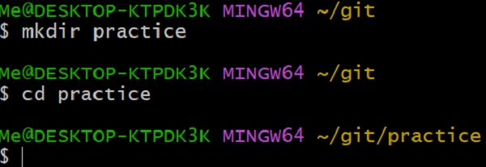

  
 

- 상위 폴더(git)으로 다시 돌아가 봅시다. `cd ../`를 입력하고 엔터를 누릅니다. 해당 폴더의 상위 폴더로 이동합니다. 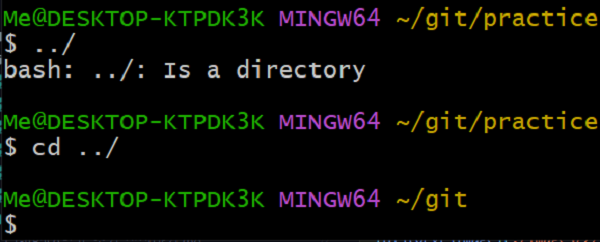

- 'practice'폴더를 삭제해 봅시다. `rm practice`로 삭제가 가능합니다.  단, 삭제 폴더의 상위 폴더에서 삭제해야 합니다. 지금은 상위 폴더 상태이므로 그대로 진행합니다.

- 삭제가 불가능하면 강제로 권한을 주어 삭제가 가능합니다. 다만 해당 폴더안에 내용을 모두 삭제하므로 반드시 확인 후 삭제해야 합니다.
  

 코드 확인하기 

  
`rm -rf 폴더명` 입력 후 엔터를 누릅니다. 반드시 반드시 확인 후 삭제해야  합니다.

  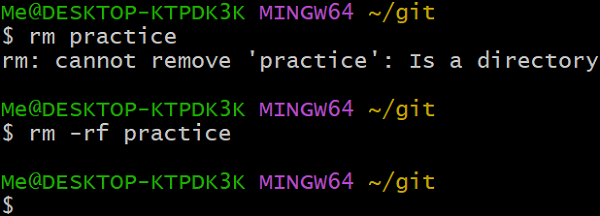

  
 

## 실습 : 온라인 저장소(GitHub)에서 저장소를 가져와 봅시다. `git clone 주소`

1. 'Github' 에서 Repository 하나를 만들고 주소를 가져옵니다. 혹은 다른 사람의 Repository 주소를 가져옵니다.
2. 'GitBash' 에서 현재 경로를 확인하고, 'git' 폴더로 이동합니다.
3. `git clone 주소` 를 입력하고 엔터를 누릅니다. 컴퓨터 및 인터넷 상태에 따라 시간이 유동적으로 소요됩니다.
4. 'git' 아래 생성된 폴더로 이동합니다. 해당 폴더 아래 있는 파일 및 폴더를 확인해 봅시다.(숨겨진 파일까지)
5. 'git' 아래 생성된 폴더를 삭제해 봅시다.

## 실습정답지

 실습 정답 확인하기 

  
 1 > 이미지 참고

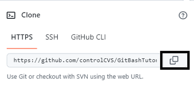

  
 2 >
  
  경로확인 `pwd`
  경로이동 `cd git`

  
 3 >  
  `git clone https://github.com/controlCVS/GitBashTutorials.git` 주소는 개인마다 다릅니다.

  
 4 >  

`cd GitBashTutorials` 폴더명은 개인마다 다릅니다, `ls`, `ls -a`로 확인 가능

  
 5 >  
  
  `pwd`로 경로 확인 `rm GitBashTutorials` `rm -rf`는 항상 신중하고 확실한 순간에만 사용합니다.

  
 
<!-- details에 코드를 넣고 싶다면, 코드 위 아래에 공백 필요-->

# 'GitBash' 명령어 끝 Level Up!
